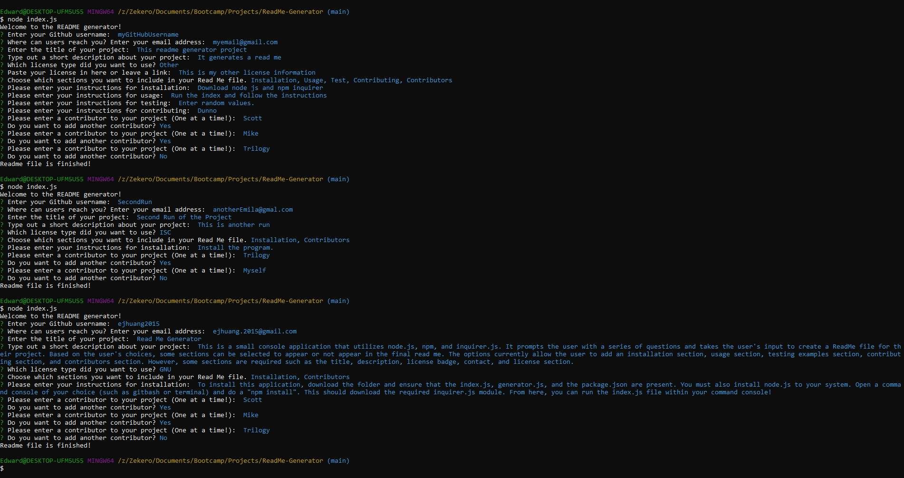

# Read Me Generator

This is a small console application that utilizes node.js, npm, and inquirer.js. It prompts the user with a series of questions and takes the user's input to create a ReadMe file for their project. Based on the user's choices, some sections can be selected to appear or not appear in the final read me. The options currently allow the user to add an installation section, usage section, testing examples section, contributing section, and contributors section. However, some sections are required such as the title, description, license badge, contact, and license section.

[Project Example Video](./assets/VideoExample.mp4)

## Table of Contents
* [Installation](#installation)
* [Contributors](#contributors)
* [Questions](#questions)
* [License](#license)
# Installation
To install this application, download the folder and ensure that the index.js, generator.js, License folder, and the package.json are present. You must also install node.js to your system. Open a command console of your choice (such as gitbash or terminal) and do a "npm install". This should download the required inquirer.js module. From here, you can run the index.js file within your command console!
# Contributors
Thanks to the following people who have contributed to this project:

* [Scott Byer](https://github.com/switch120) 
* [Mike Fearly](https://michaelfearnley.com/)
* UNH Full Stack Development Bootcamp

# Questions
You can find me at my [github page here](https://github.com/ejhuang2015).
Any comments, questions, or concerns? Email me  at ejhuang.2015@gmail.com.

# License
### Copyright (c) [2021] [ehuang2015]
View the license in [license.txt](./license.txt)
